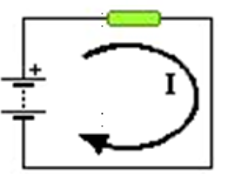
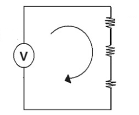

## :trophy: C1.2 Reto en clase

**Conceptos de electrónica básica y circuitos**

### :blue_book: Instrucciones
___

- De acuerdo con la información presentada por el asesor referente al tema electrónica básica, contestar las preguntas indicadas dentro del apartado desarrollo.

### :pencil2: Desarrollo
___
1. Analizar los tres siguientes circuitos y responder a lo que se pregunta en cada uno de ellos, **explicando** como se obtuvo el resultado.

+ Un circuito que tiene una pila de 6 voltios genera una corriente que atraviesa una resistencia eléctrica de 2 ohmios. Cual es el valor de la intensidad de la corriente que pasa por la resistencia?
  
  - **Respuesta**: I= V/R = 6V/2ohms = 3A

    Elemento | Valor | 
    ---------|----------|
    R | 2 ohms | 
    V | 6 v | 
    IR | 3 A | 

+ Hallar la tension de la pila que necesitas para que pase una corriente cuya intensidad es de 3 amperes por una bombilla que tiene 2 ohmios de resistencia.

  + **Respuesta**: V = R*I = 2ohms * 3A = 6V

    Elemento | Valor | 
    ---------|----------|
    V | 6 V | 
    I | 3 amp | 
    R | 2 ohms | 

+ Calcular la corriente eléctrica total y el voltaje en cada resistencia 

  + **Respuesta**: IT = VT/RT y V = R*I

      IT = 60V/212ohms = 0.283A

      VR1 = 80ohms * 0.283 = 22.64V

      VR2 = 120ohms * 0.283 = 33.96V

      VR1 = 12ohms * 0.283 = 3.39V

    Elemento | Valor | 
    ---------|----------|
    R1 | 80 ohms | 
    R2 | 120 ohms | 
    R3 | 12 ohms | 
    VT | 60 volts | 
    VR1 | 22.64 volts | 
    VR2 | 33.96 volts |     
    VR3 | 3.39 volts | 
    IT |  0.283 amperios | 

___

### :bomb: Rubrica

| Criterios     | Descripción                                                                                  | Puntaje |
| ------------- | -------------------------------------------------------------------------------------------- | ------- |
| Instrucciones | Se cumple con cada uno de los puntos indicados dentro del apartado Instrucciones?            | 20 |
| Desarrollo    | Se respondió a cada uno de los puntos solicitados dentro del desarrollo de la actividad?     | 80      |

:house: [Ir a mi Github](https://github.com/GlzAlexis/Sistemas_Programables)