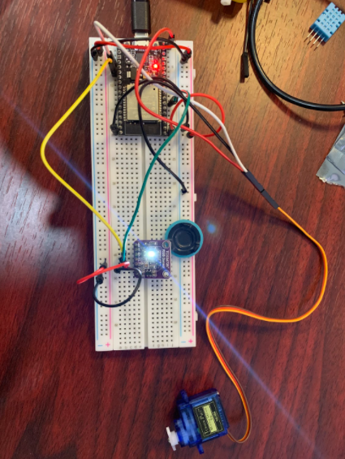
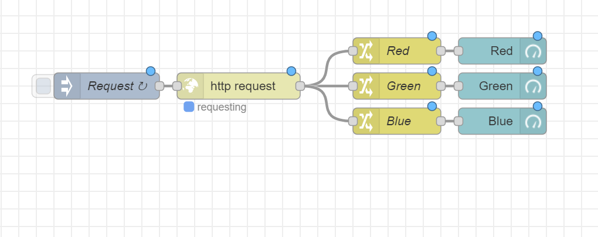
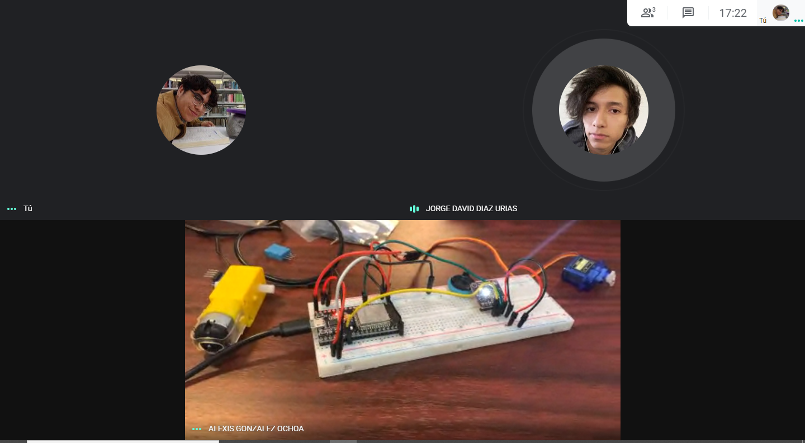
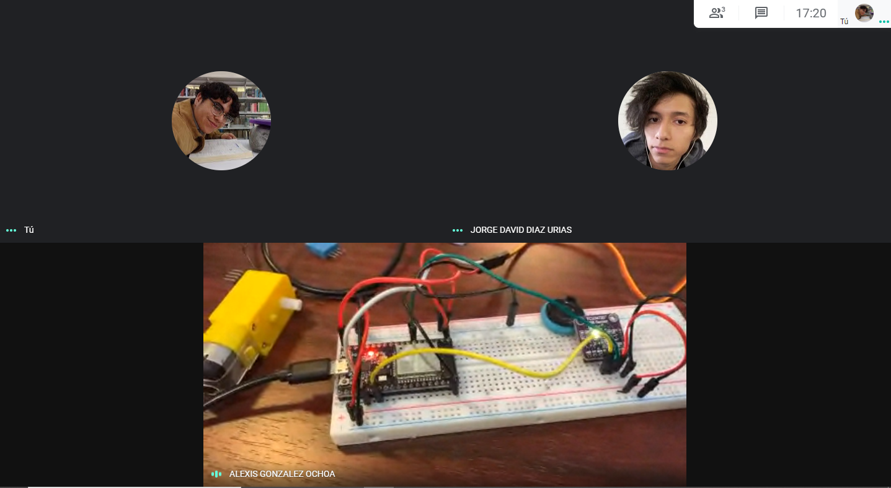

# :trophy: A5.2 Actividad de aprendizaje

Sistema sensor y actuacion del color de un objeto, e interface visual
___

## Instrucciones

- Realizar un sistema de identificacion de color utilizando un sensor de RGB TCS34725, un nodeMCU ESP32, un actuador Servomotor SG90, cualquier protocolo de comunicación y una interface visual que puede ser desarrollada por el equipo o apoyandose de otras como Node-red por ejemplo.
- Toda actividad o reto se deberá realizar utilizando el estilo **MarkDown con extension .md** y el entorno de desarrollo VSCode, debiendo ser elaborado como un documento **single page**, es decir si el documento cuanta con imágenes, enlaces o cualquier documento externo debe ser accedido desde etiquetas y enlaces, y debe ser nombrado con la nomenclatura **A5.2_NombreApellido_Equipo.pdf.**
- Es requisito que el .md contenga una etiqueta del enlace al repositorio de su documento en GITHUB, por ejemplo **Enlace a mi GitHub** y al concluir el reto se deberá subir a github.
- Desde el archivo **.md** exporte un archivo **.pdf** que deberá subirse a classroom dentro de su apartado correspondiente, sirviendo como evidencia de su entrega, ya que siendo la plataforma **oficial** aquí se recibirá la calificación de su actividad.
- Considerando que el archivo .PDF, el cual fue obtenido desde archivo .MD, ambos deben ser idénticos.
- Su repositorio ademas de que debe contar con un archivo **readme**.md dentro de su directorio raíz, con la información como datos del estudiante, equipo de trabajo, materia, carrera, datos del asesor, e incluso logotipo o imágenes, debe tener un apartado de contenidos o indice, los cuales realmente son ligas o **enlaces a sus documentos .md**, _evite utilizar texto_ para indicar enlaces internos o externo.
- Se propone una estructura tal como esta indicada abajo, sin embargo puede utilizarse cualquier otra que le apoye para organizar su repositorio.
  
```
- readme.md
  - blog
    - C5.1_TituloActividad.md
    - C5.2_TituloActividad.md    
  - img
  - docs
    - A5.1_TituloActividad.md
    - A5.2_TituloActividad.md    
```

___

## Desarrollo

1. Utilizar el siguiente listado de materiales para la elaboración de la actividad

| Cantidad | Descripción    |
| -------- | -------------- |
| 1        | Sensor RGB [TCS34725](https://www.luisllamas.es/arduino-sensor-color-rgb-tcs34725/) |
| 1 | Servomotor [SG90](https://articulo.mercadolibre.com.mx/MLM-585222055-servomotor-micro-sg90-arduino-pic-raspberry-_JM#position=1&type=item&tracking_id=97f8d046-a63f-4384-a4c1-d3a922b69054)  |
| 1        | Fuente de voltaje de 5V                                                                                                                                |
| 1        | [NodeMCU ESP32](https://www.amazon.com.mx/ESP-32-ESP-32S-ESP-WROOM-32-ESP32-S-desarrollo/dp/B07TBFC75Z/ref=sr_1_2?__mk_es_MX=%C3%85M%C3%85%C5%BD%C3%95%C3%91&dchild=1&keywords=esp32&qid=1599003438&sr=8-2)                |
| 1        | [BreadBoard](https://www.amazon.com.mx/Deke-Home-Breadboard-distribuci%C3%B3n-electr%C3%B3nica/dp/B086C9HK7V/ref=sr_1_22?__mk_es_MX=%C3%85M%C3%85%C5%BD%C3%95%C3%91&dchild=1&keywords=breadboard&qid=1599003455&sr=8-22)   |
| 1        | [Jumpers M/M](https://www.amazon.com.mx/ELEGOO-Macho-Hembra-Macho-Macho-Hembra-Hembra-Protoboard/dp/B06ZXSQ5WG/ref=sr_1_1?__mk_es_MX=%C3%85M%C3%85%C5%BD%C3%95%C3%91&dchild=1&keywords=jumper+wires&qid=1599003519&sr=8-1) |


2. Basado en las imágenes que se muestran en las **Figura 1**, realizar un sistema capaz de cumplir con las siguientes condiciones:
   
   - La primer fase de la actividad consistira en, al colocar un objeto frente al sensor RGB, este debera identificar que color tiene (es recomendable utiizar objetos de color Rojo, Verde, y Azul para mayor precision), el cual debera mostrar en un interface visual que color fue detectado.
   - La segunda fase, consistira en agregar un actuador que y un identificador de color apoyandose de una banda de colores como se muestra en la imagen 1; al conocer el color del objeto el actuador debera apuntar al color que se esta detectando.

 <p align="center"> 
    <strong>Figura 1 Circuito ESP32 Sensor de color y Servomotor</strong>
    
</p>

3. Coloque aquí la imagen del circuito ensamblado



4. Coloque en este lugar el programa creado dentro del entorno de Arduino

#### Codigo Arduino
```c
#include <Servo.h>
#include <WiFi.h>
#include <WebServer.h>
#include <Wire.h>
#include "Adafruit_TCS34725.h"
 
const byte Motor = 2;  // Se declaran los pines para el motor y el sensor
const byte Sda = 4;
const byte Slc = 32;

WebServer server(80);  // Se declara el servidor
const char* ssid = "100 Euros";                // Se definen las variables para el Wifi
const char* password = "Enrollados En Tu Ano";

Servo servo;  // Se declara el servomotor
float R, G, B; // Variables para los colores
// Se inicializa el sensor con valores de tiempo y ganancia especificos
Adafruit_TCS34725 tcs = Adafruit_TCS34725(TCS34725_INTEGRATIONTIME_700MS, TCS34725_GAIN_1X);

void Colors()  // Funcion para enviar los datos recogidos
{
  server.send(200, "application/json", "{\"R\": " + String((int)R) + ", \"G\": " + String((int)G) + ", \"B\": " + String((int)B) + "}");
}

void setup_wifi()             // Conexion de wifi
{
   Serial.print("Connecting to ");
  Serial.println(ssid);

  WiFi.begin(ssid, password);

  while (WiFi.status() != WL_CONNECTED) 
  {
    delay(500);
    Serial.print(".");
  }

  Serial.println("");
  Serial.println("WiFi connected");
  Serial.println("IP address: ");
  Serial.println(WiFi.localIP());
}
 

void setup() {         
  Serial.begin(115200);
  servo.attach(Motor); // Se inicia el servomor
  Wire.begin(Sda, Slc); // Se inicia el sensor con los pines
   
  if (tcs.begin()) // Busca que el sensor este inicializado
    {
    Serial.println("Found sensor");
    } 
  else 
    {
    Serial.println("No TCS34725 found ... check your connections");
    while (1);
    }
    setup_wifi();     // Se hace la conexion al wifi
    server.on("/", Colors);  // http server
    server.begin();
}

void loop() 
{
    tcs.getRGB(&R, &G, &B); // Toma los valores qye se asignaran a los variables RGB

    if(R > G && R > B)  // Define el movimiento del servo motos en base del color que mayor se
    {                   // se detecta
      servo.write(135);
    }
    else if (G > B) 
    {
      servo.write(90);
    }
    else servo.write(45);
    server.handleClient();
}
```

#### Codigo Node-Red
```C
[{"id":"f6f2187d.f17ca8","type":"tab","label":"Flow 1","disabled":false,"info":""},
{"id":"cbe892eb.7e65e8","type":"inject","z":"f6f2187d.f17ca8","name":"Request","props":
[],"repeat":"1","crontab":"","once":false,"onceDelay":0.1,"topic":"","x":180,"y":120,
"wires":[["1eab1382.257944"]]},{"id":"e45c198c.745e98","type":"change","z":"f6f2187d.
f17ca8","name":"Green","rules":[{"t":"set","p":"payload","pt":"msg","to":"payload.G",
"tot":"msg"}],"action":"","property":"","from":"","to":"","reg":false,"x":510,"y":120,
"wires":[["15954cb2.9c79ab"]]},{"id":"a653acb.f79e35","type":"change","z":"f6f2187d.
f17ca8","name":"Red","rules":[{"t":"set","p":"payload","pt":"msg","to":"payload.R",
"tot":"msg"}],"action":"","property":"","from":"","to":"","reg":false,"x":510,"y":80,
"wires":[["b98438b1.0f0f1"]]},{"id":"d5f1501a.d80ad8","type":"change","z":"f6f2187d.
f17ca8","name":"Blue","rules":[{"t":"set","p":"payload","pt":"msg","to":"payload.B",
"tot":"msg"}],"action":"","property":"","from":"","to":"","reg":false,"x":510,"y":160,
"wires":[["a18e2e9b.e0fb18"]]},{"id":"b98438b1.0f0f1","type":"ui_gauge","z":"f6f2187d.
f17ca8","name":"","group":"fe5d2427.20272","order":0,"width":"2","height":"2",
"gtype":"gage","title":"Red","label":"","format":"{{value}}","min":0,"max":"200",
"colors":["#000000","#ff0000","#ff0000"],"seg1":"","seg2":"","x":630,"y":80,"wires":[]}
,{"id":"15954cb2.9c79ab","type":"ui_gauge","z":"f6f2187d.f17ca8","name":"",
"group":"fe5d2427.20272","order":0,"width":"2","height":"2","gtype":"gage",
"title":"Green","label":"","format":"{{value}}","min":0,"max":"200","colors":
["#000000","#00ff00","#00ff00"],"seg1":"","seg2":"","x":630,"y":120,"wires":[]},
{"id":"a18e2e9b.e0fb18","type":"ui_gauge","z":"f6f2187d.f17ca8","name":"",
"group":"fe5d2427.20272","order":0,"width":"2","height":"2","gtype":"gage",
"title":"Blue","label":"","format":"{{value}}","min":0,"max":"200","colors":["#000000",
"#0000ff","#0000ff"],"seg1":"","seg2":"","x":630,"y":160,"wires":[]},{"id":"1eab1382.
","type":"http request","z":"f6f2187d.f17ca8","name":"","method":"GET","ret":"obj",
"paytoqs":"ignore","url":"192.168.100.58","tls":"","persist":false,"proxy":"",
"authType":"","x":330,"y":120,"wires":[["e45c198c.745e98","a653acb.f79e35","d5f1501a.
d80ad8"]]},{"id":"fe5d2427.20272","type":"ui_group","name":"Colors","tab":"70fc2d5.
8507854","order":1,"disp":true,"width":"6","collapse":false},{"id":"70fc2d5.8507854",
"type":"ui_tab","name":"ESP32 RGB Sensor","icon":"dashboard","disabled":false,
"hidden":false}]
```
5. Coloque aquí evidencias que considere importantes durante el desarrollo de la actividad.





6. Para la demostracion de la actividad deberan utilizarse mas de un objeto para poder cubrir minimo tres colores.

[Video demostrativo](https://youtu.be/X5Bd1QDTxN8)

7. Conclusiones

Alexis Gonzalez Ochoa: 
Fue bastante interesante poder trabajar con node-red para poder visualizar datos desde una pantalla. Además de que fue un poco complicado hacer que el ordenador actuara como un servidor y tuvimos que hacer que el mismo arduino actuará como uno haciendo que node-red sea el que se conecte al ESP32. Realmente por el lado de hacer el programa para que el servo actuará de manera al color que detectaba fue fácil, el lado complicado fue conectarlo y el funcionamiento de node-red.

Jorge Diaz: 
Con la realización de esta práctica podemos darnos cuenta de cómo podemos usar el node-red para la interconexión con el ESP32, a simple vista node-red parecer ser muy fácil de entender pero ciertamente si toma un poco comprender el funcionamiento del node-red (por lo menos para mi) y es que puede ser muy útil utilizarlo para aplicaciones de monitoreo por ejemplo, que nos permitan monitorear el estado de una aplicación. Además también se pudo ver el funcionamiento del RGB TCS el cual es un sensor que nos permite medir los valores RGB de un objeto y al usarlo con un servomotor como emplea en la práctica podemos darnos cuenta los diferentes tipos de uso que se le pueden dar al sensor.

Julio Jimenez: 
En conclusión, para mi la práctica fue bastante desafiante, en el sentido de que nos hizo pensar más sobre el funcionamiento y la programación del código, la implementación de Node-red con el ESP-32 nos abrió las puertas para poder manejar y observar el funcionamiento de nuestra aplicación, al igual que en un futuro poder aplicar estos conocimientos en diferentes casos. Definitivamente es un conocimiento que va a ser indispensable en nuestra área. Esto combinado con el sensor RGB TCS que permite detectar y medir valores de color por asi decirlo, de la misma forma el servotor en conjunto con las demás herramientas anteriores nos permitió realizar y aprender en esta práctica.

___

### :bomb: Rubrica

| Criterios     | Descripción                                                                                  | Puntaje |
| ------------- | -------------------------------------------------------------------------------------------- | ------- |
| Instrucciones | Se cumple con cada uno de los puntos indicados dentro del apartado Instrucciones?            | 10      |
| Desarrollo    | Se respondió a cada uno de los puntos solicitados dentro del desarrollo de la actividad?     | 60      |
| Demostración  | El alumno se presenta durante la explicación de la funcionalidad de la actividad?            | 20      |
| Conclusiones  | Se incluye una opinión personal de la actividad  por cada uno de los integrantes del equipo? | 10      |

:house: [Ir a GitHub de Julio Jimenez](https://github.com/JJimenez2117/SistemasProg/blob/master/README.md)
 
:house: [Ir a GitHub de Jorge Diaz](https://github.com/JDavidDiaz/Sistemas-Programables)
 
:house: [Ir a GitHub de Alexis Gonzalez](https://github.com/GlzAlexis/Sistemas_Programables)

